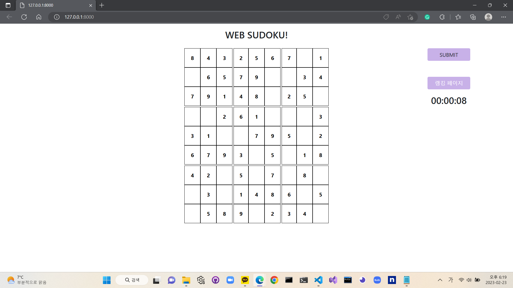
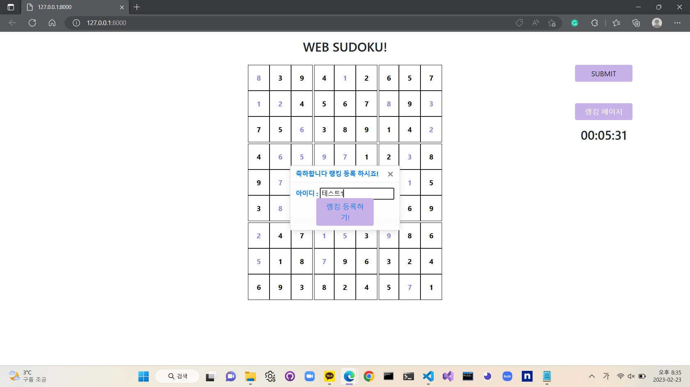
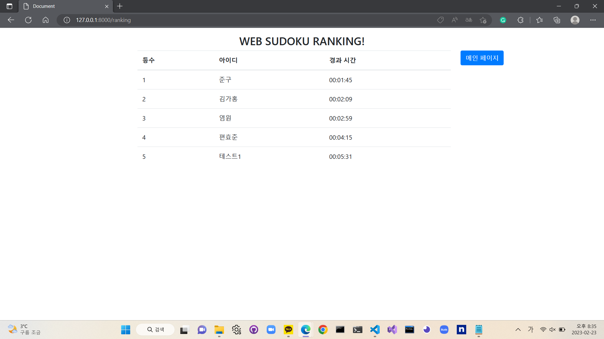

# Sudoku-Project

# 소개

클라이언트를 Django 템플릿으로 제작하고 전반적인 게임의 처리를 서버에서 모듈의 형태로 처리하는 웹 스도쿠게임입니다.
사용자가 게임을 시작하는 동시에 타이머가 돌아가고 사용자는 스도쿠 퍼즐을 풀어갑니다.
Submit 버튼을 누르면 퍼즐의 정답 유무를 판단하고 정답이라면 닉네임을 입력하고 랭킹에 등록을 할 수 있습니다.
랭킹 페이지에 들어가면 정답자들의 클리어 시간에 따른 랭킹이 1등부터 순서대로 사용자에게 보여지는 구조입니다.

# 화면 1

    

   
  
   

# 화면 2

    

   
  
   

# 화면 3

    

   
  
   

